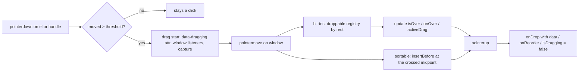
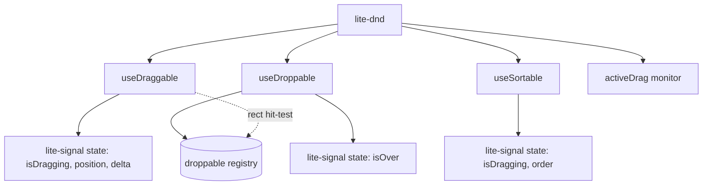

# @zakkster/lite-dnd

[](https://www.npmjs.com/package/@zakkster/lite-dnd)

[](https://github.com/sponsors/PeshoVurtoleta)
[](https://bundlephobia.com/result?p=@zakkster/lite-dnd)
[](https://www.npmjs.com/package/@zakkster/lite-dnd)
[](https://www.npmjs.com/package/@zakkster/lite-dnd)
[](https://github.com/PeshoVurtoleta/lite-signal)
[](./Dnd.d.ts)

[](LICENSE)

Framework-agnostic **drag-and-drop primitives that survive DOM reparents**. `useDraggable`, `useDroppable`, and `useSortable` operate on plain elements, expose their state as [`@zakkster/lite-signal`](https://www.npmjs.com/package/@zakkster/lite-signal) signals, and keep a drag alive even when the dragged element is reordered or removed mid-flight -- the move that destroys every DnD library built on cached DOM references.

```js
import { useDraggable, useDroppable } from "@zakkster/lite-dnd";

const drag = useDraggable(cardEl, { data: { id: 42, type: "todo" }, handle: ".grip" });
drag.isDragging();          // signal -> boolean
drag.position();            // signal -> { x, y }

const drop = useDroppable(listEl, {
    accepts: ["todo"],
    onDrop: (data) => console.log("dropped", data),
});
drop.isOver();              // signal -> boolean
```

## Install

State is exposed as lite-signal signals, so `@zakkster/lite-signal` is a **peer dependency**:

```sh
npm install @zakkster/lite-dnd @zakkster/lite-signal
```

Browser/DOM runtime. Zero runtime dependencies of its own.

## Why it survives reparents

Every DnD library that holds a raw DOM reference breaks the moment a framework re-renders, sorts, or `insertBefore`s the dragged node. lite-dnd avoids that on three levels:

1. The in-flight drag is tracked on the element's **owner window** (`pointermove`/`pointerup` listen on `window`, never on the node), so the node can be reparented or removed without interrupting the drag.
2. A drag's identity is its **data payload**, and drops are resolved by **live rect hit-testing** against a registry of droppables -- never by a stored element reference.
3. `useSortable` reorders with native **`insertBefore`**, which preserves a node's identity and listeners.

Paired with [`@zakkster/lite-element`](https://www.npmjs.com/package/@zakkster/lite-element) -- whose components survive synchronous reparents via a microtask-gated teardown -- reordering a list keeps each item's **internal component state** intact. lite-dnd needs no knowledge of any component framework to make this work; it just respects the native DOM.



## Performance

Per pointermove the library allocates **no JavaScript objects of its own**. The reactive accessors `position()`, `delta()` and `activeDrag()` return stable references whose fields are mutated in place; reactivity is driven by a version-counter signal. Read the fields synchronously inside an effect -- typically via destructuring -- and do not retain the returned reference across frames:

```js
effect(() => {
    const { dx, dy } = drag.delta();                    // destructure on read
    el.style.transform = `translate(${dx}px,${dy}px)`;
});
```

The only platform-mandated per-move allocation is the `DOMRect` produced by `Element.getBoundingClientRect` during hit-testing, which is outside the library's control.

A zero-GC contract test (`test/08-zero-gc.test.mjs`) locks this in: 200 pointermoves across two drop zones must produce zero new-ref reads from any of the three signals.

## API

### `useDraggable(el, options?)`
Makes `el` draggable. Options: `data` (payload), `handle` (selector resolved within `el`, or an element), `disabled` (boolean or function), `axis` (`'x'|'y'|'both'`, default `both`), `threshold` (px before a click becomes a drag, default `4`), and `onStart`/`onMove`/`onEnd` callbacks receiving a context `{ data, x, y, dx, dy, over, cancelled }`. For zero per-move allocation that context object is reused across a drag's callbacks (mutated in place); it is valid only synchronously inside the callback, so copy any field you need to keep. Returns `{ isDragging, position, delta, data, destroy() }` -- the first three are reactive signal accessors. A `data-dragging` attribute is set on `el` for the duration of the drag.

### `useDroppable(el, options?)`
Registers `el` as a drop target. Options: `accepts` (an array of `data.type` strings, or a predicate over the payload), `disabled` (boolean or function), and `onEnter`/`onLeave`/`onOver`/`onDrop` callbacks. `onDrop` receives `(data, ctx)`. Returns `{ isOver, destroy() }`. When droppables overlap, the **innermost (smallest-area)** one whose rect contains the pointer wins.

`onEnter`/`onLeave` are **symmetric**: every `onEnter` is paired with an `onLeave`, including at drop time and on cancellation. If a drag ends *on* a droppable that was entered, that droppable receives `onDrop` followed by `onLeave`. If a drag is cancelled while over a droppable, that droppable receives `onLeave`.

### `useSortable(container, options?)`
Makes `container`'s element children sortable by dragging. It is **managed**: it reorders the DOM with native `insertBefore` during the drag (the right model for the vanilla/lite-element world; in a virtual-DOM host you would use the primitives above and reorder your own data). Options: `handle` (selector within an item), `axis` (`'x'|'y'`, default `y`), `threshold` (default `4`), `disabled`, and `onReorder(order, ctx)`. Returns `{ isDragging, order, destroy() }`.

`order` is a permutation where `order[newIndex]` is the item's **original index** at drag start. Apply it to your data model:

```js
useSortable(listEl, { onReorder: (order) => { todos = order.map((i) => todos[i]); } });
```

### `activeDrag()`
A reactive read of the in-flight drag: `{ data, over }` while a drag is active, otherwise `null`. Useful for global affordances ("highlight every valid drop zone the instant a drag starts") without wiring your own listeners. Like `position`/`delta`, the returned object is reused across transitions (mutated in place); read its fields synchronously inside an effect.

### `DnDError`
Thrown synchronously for misuse. `.code` is one of `invalid_target` (the element argument is not a DOM element), `invalid_options` (malformed options), or `not_supported` (no DOM/window pointer environment).



## Styling a drag

The dragged element (and the dragged sortable item) carries a `data-dragging` attribute while active:

```css
[data-dragging] { opacity: .6; cursor: grabbing; }
```

For free movement, read `position()`/`delta()` in an effect and apply a transform. lite-dnd does not create a floating clone in v1 (see below).

## Testing

DnD is pointer + DOM behavior, so tests run under a DOM implementation such as `happy-dom` (a dev dependency here). Because there is no layout engine, supply element rects with a `getBoundingClientRect` stub and dispatch `PointerEvent`s -- which is exactly how lite-dnd hit-tests in production, so the tests stay deterministic. The suite covers the draggable lifecycle, droppable acceptance / overlap / symmetric enter-leave, sortable reordering and identity preservation, the reparent-during-drag case, a lite-element list whose component state survives a reorder, idempotent destroy, mid-drag destroy, and the zero-allocation hot-path contract.

## Scope and limitations

v1 is intentionally small and primitive. Out of scope: a custom floating drag-image clone, multi-touch / simultaneous drags, edge auto-scroll, keyboard-accessible dragging, and FLIP reorder animations. Dragging an item from one list into another is expressed with `useDraggable` + `useDroppable` (drop the payload, move it yourself); a dedicated cross-list sortable is a candidate for a later version.

## License

MIT (c) Zahary Shinikchiev
